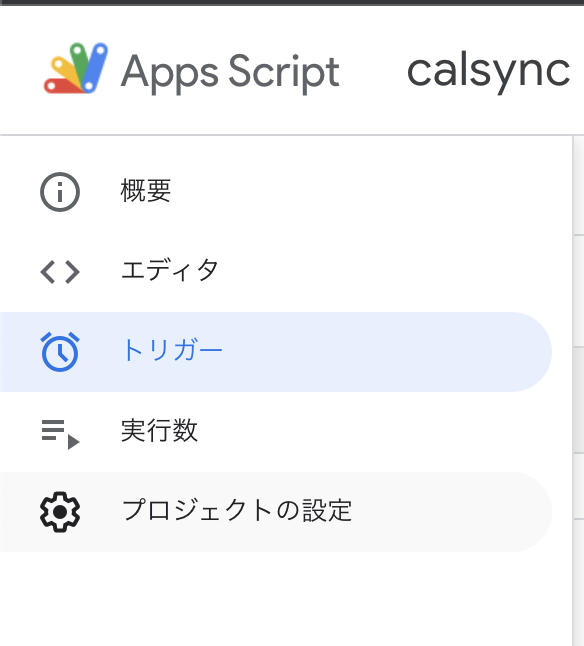
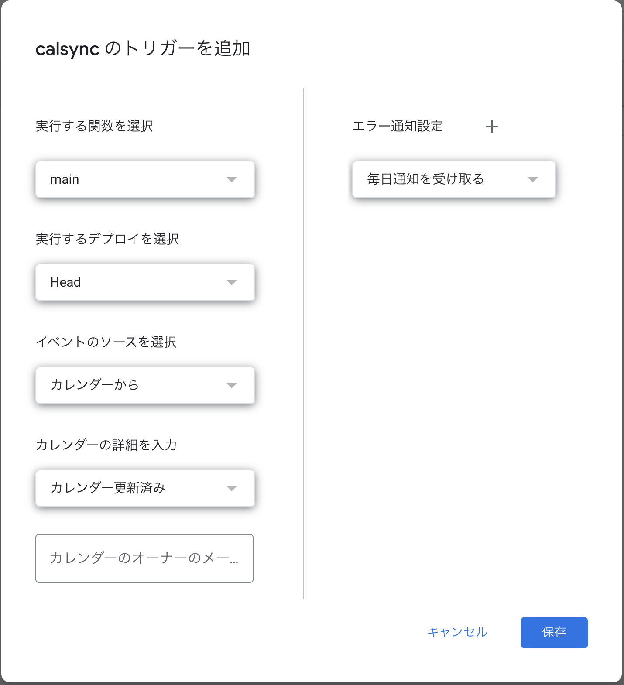

# Calsync

Calsync is a Open Source Code (OSS) to make your personal Google Calendar synchronize with other Google (Workspace) Calendars using Google Apps Script (GAS).
You can use regular expression so that only matched events are imported to your personal calendar.

## Installation

1. Install [Clasp](https://github.com/google/clasp). Refer to the procedures given in the link.

2. Clone this repository

    ```bash
    git clone https://github.com/KentaroJay/gas-calsync.git
    ```

3. Add your `.clasp.json` to the directory. (path-to/gas-calsync/)
4. Install all the library in `package.json`.
    ```bash
    npm install
    ```

## Settings
1. Make `env.js` in `src`.
2. Write your calendar ids in `env.js` that looks like this...
    ```javascript
    export const SYNC_TO = "Your Personal Calendar id"
    // xxxxx.xxxx.xxxx@gmail.com
    export const SYNC_FROM = "Your Google Workspace Calendar id"
    // xxxxxxxxxxxxxxx@group.calendar.google.com
    export const REG_PATTERN = /regular expression that matches what you want to import from your Workspace Calendar/gm
    ```

## Start synchronizing your calendars!
1. Build source code.
    ```bash
    npm run build
    ```
2. Push the code to GAS.
    ```bash
    npm run push
    ```
3. Set up firing trigger.

    Navigate to trigger setup page. It looks like this.

    

    Hit "Add a trigger" button on the corner of right bottom.

    Set "from calendar" in the "select event source" section, and put your workspace calendar id (mail address) in the placeholder. This enables GAS to execute synchronizing program when your workspace calendar is updated.

    

    Done!!
## Contributing
Pull requests are welcome. For major changes, please open an issue first to discuss what you would like to change.

Please make sure to update tests as appropriate.

## License
[MIT](https://choosealicense.com/licenses/mit/)